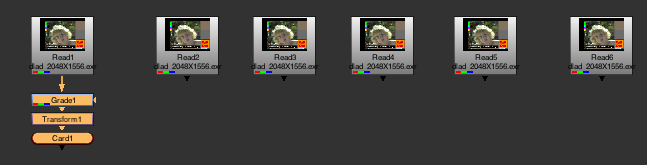
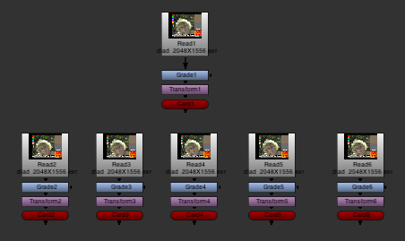
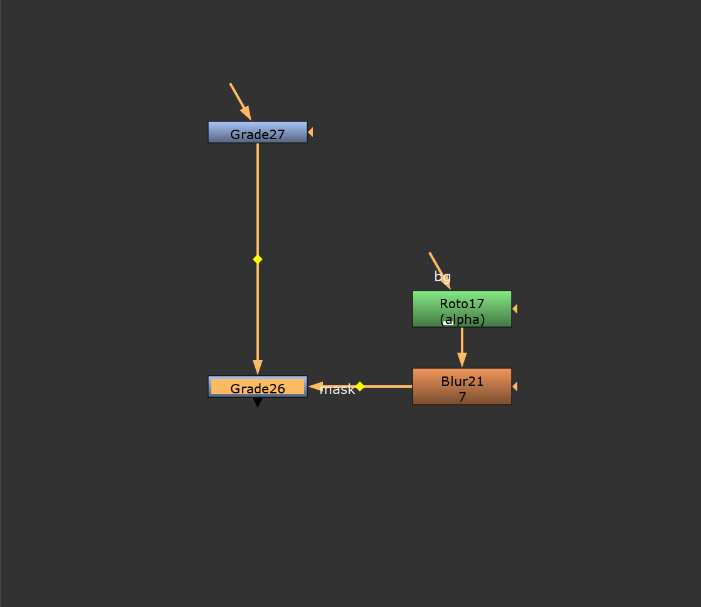
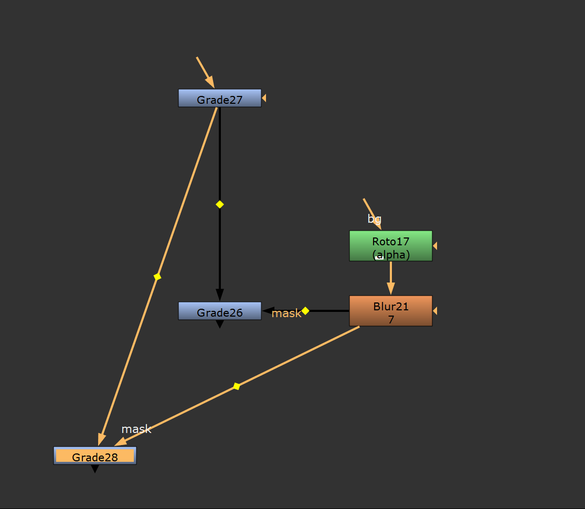

<p>
  
  <span style="font-size:1.6em;font-weight:700;line-height:1;">LGA TOOL PACK B</span><br><br>
  <span style="font-style:italic;line-height:1;">Lega | v2.4</span><br>
</p>
<br clear="left">


## Instalación

- Copiar la carpeta **LGA_ToolPack-B** que contiene todos los
  archivos **.py** a **%USERPROFILE%/.nuke**.

- Con un editor de texto, agregar esta línea de código al archivo
  **init.py** que está dentro de la carpeta **.nuke**:

  ```
  nuke.pluginAddPath('./LGA_ToolPack-B')
  ```

- El ToolPack permite **activar/desactivar** herramientas sin tocar
  código editando el archivo **\_LGA_ToolPack-B_Enabled.ini**<br>
  (dentro de **LGA_ToolPack-B**/).\<br>
  Por defecto todas las herramientas están en **True**. Cambiar a
  **False** las oculta y evita cargar su script.\
  Para conservar la configuración en futuras actualizaciones, se puede<br>
  copiar el archivo a **\~/.nuke/\_LGA_ToolPack-B_Enabled.ini**. Si<br>
  existen ambos, tiene prioridad el de **\~/.nuke/.**

<br><br>


##  Media Missing Frames v1.1 - Lega | *Ctrl + Alt + Shift + M*

Escanea todos los nodos Read del script y detecta secuencias EXR con frames faltantes.<br>
Muestra una tabla con la ruta del archivo, el nombre del Read, el rango detectado y los frames ausentes para localizar rápidamente problemas de media antes de renderizar o publicar.


<br><br>
##  Reload all Reads v1.0 - Lega | *Ctrl + Alt + Shift + R*
Ejecuta el comando **reload** sobre todos los nodos Read del script actual.<br>
Útil cuando se actualizó media en disco y se quiere refrescar todo el proyecto de una sola vez.


<br><br>
##  Rename Writes from Reads v1.0 - Lega | *F2*
Renombra los nodos Write seleccionados usando el nombre del archivo del Read conectado aguas arriba.<br>
Elimina el padding final después del último guion bajo para dejar un nombre más limpio y consistente en los Writes.


<br><br>
##  Media path replacer v1.6 - Lega

Para cuando hay missing media porque se cambió la ubicación del proyecto y su media.<br>
Permite buscar y reemplazar rutas en los nodos Read y Write. Da la opción de filtrar listas, incluir sólo nodos Read o Write, y tiene un sistema de presets para guardar y cargar configuraciones frecuentes.<br>
Útil para actualizar rutas de archivos cuando se mueven proyectos a otras carpetas o discos.


<br><br>


##  Read -> FrameRange v1.0 - Lega | *Ctrl + Alt + F*

Copia el rango de frames de un nodo Read seleccionado a uno o más nodos FrameRange seleccionados.<br>
La herramienta requiere seleccionar exactamente un Read y al menos un FrameRange.


<br><br>
##  Read -> Write v1.0 - Lega

Activa **use limit** en todos los nodos Write del script y ajusta su rango para que coincida con el frame range detectado en su contexto actual.<br>
Sirve para dejar los Writes limitados al rango correcto sin editar cada nodo manualmente.


<br><br>
##  TimeClip -> Write v1.0 - Lega | *Ctrl + T*

Copia el rango de frames de un nodo TimeClip al nodo Write seleccionado.<br>
La herramienta requiere seleccionar exactamente un Write y un TimeClip.


<br><br>
## <span style="color:#4dcb9d;">COPY n PASTE</span>

##  Paste to selected v1.1 - Frank Rueter | *Ctrl + Shift + V*

[http://www.nukepedia.com/python/nodegraph/pastetoselected](http://www.nukepedia.com/python/nodegraph/pastetoselected)<br>
Pega los nodos del portapapeles a todos los nodos seleccionados.<br>




<br><br>
##  Duplicate with inputs v1.3 - Marcel Pichert

[http://www.nukepedia.com/python/nodegraph/duplicate-with-inputs](http://www.nukepedia.com/python/nodegraph/duplicate-with-inputs)<br>
Duplica los nodos seleccionados y mantiene todas sus conexiones con nodos que no están en la selección. Se pueden duplicar los nodos directamente o copiarlos primero y pegarlos en otro lugar del script más tarde.<br>




**Shortcut**

Ctrl + Alt + C Copy with inputs<br>
Ctrl + Alt + V Paste with inputs<br>
Ctrl + Alt + K Duplicate with inputs

<br><br>


Esta sección agrupa herramientas para construir setups, editar knobs o acelerar tareas repetitivas dentro del script.


##  DasGrain Kronos Comp v1.1 - Lega

Sincroniza la intensidad del grano de un nodo **DasGrain** con la interpolación de un nodo **Kronos**.<br>
Agrega un tab **KroComp** al DasGrain seleccionado, crea knobs de control y modifica la expresión del knob **luminance** para compensar el grano en frames interpolados.


<br><br>
##  Animation Maker v1.4 - David Emeny 2021

Agrega un editor visual para construir expresiones de animación con eases, loops y waves sobre knobs animables.<br>
Se accede desde el menú contextual de cualquier knob animable con **Right click > Animation Maker**.


<br><br>
##  Multi Knob Edit - Thorsten Loeffler | *F12*

Permite editar un mismo knob sobre múltiples nodos al mismo tiempo desde una sola interfaz.<br>
Es útil para cambios masivos rápidos cuando hay que igualar parámetros entre varios nodos seleccionados.


<br><br>
##  Edit Default Knobs Values

Abre una ventana para definir, listar y resetear valores por defecto de knobs en Nuke.<br>
Incluye integración con el menú **Animation** para crear nuevos `knobDefault`, revisar la lista activa y restaurar valores.


<br><br>


##  OCIOFileTransform Setup v1.0 - Lega | *Ctrl + Alt + Shift + I*

Duplica un nodo **OCIOFileTransform** seleccionado, conserva su configuración y prepara una copia rotulada como **MOV Render**.<br>
Además asigna el nodo original como **Input Process** en los viewers disponibles para acelerar el setup de visualización y render.


<br><br>
##  CDL -> CC Input Process v1.0 - Lega

Lee un archivo CDL desde un nodo **Read** u **OCIOCDLTransform**, genera un archivo **.cc** y crea nodos **OCIOFileTransform** para usarlo tanto en render como en el Input Process del viewer.<br>
Sirve para convertir grades CDL en un setup práctico de visualización y salida dentro del script.


<br><br>
##  Performance Timers

Abre un panel con controles para iniciar, detener y resetear los performance timers de Nuke.<br>
También registra el panel dentro del menú **Pane** para dejarlo disponible como panel acoplable.


<br><br>
##  Edit Keyboard Shortcuts - shortcuteditor v1.2

Abre una interfaz para revisar y editar shortcuts del menú de Nuke.<br>
La herramienta se integra al arranque del ToolPack-B y permite redefinir teclas sin editar manualmente `menu.py`.

