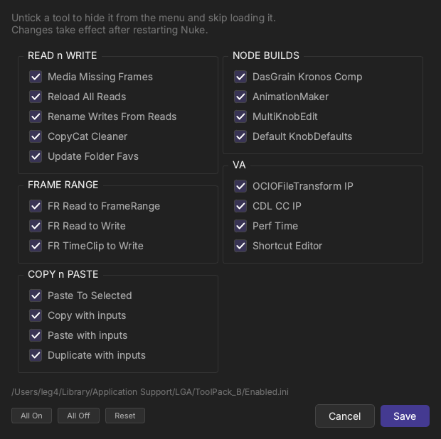
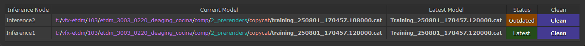
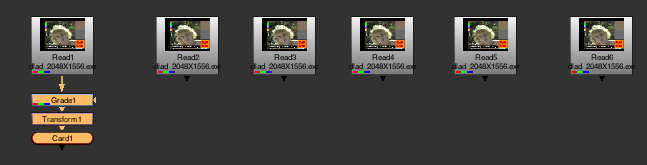
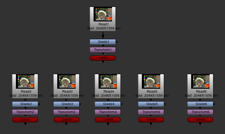
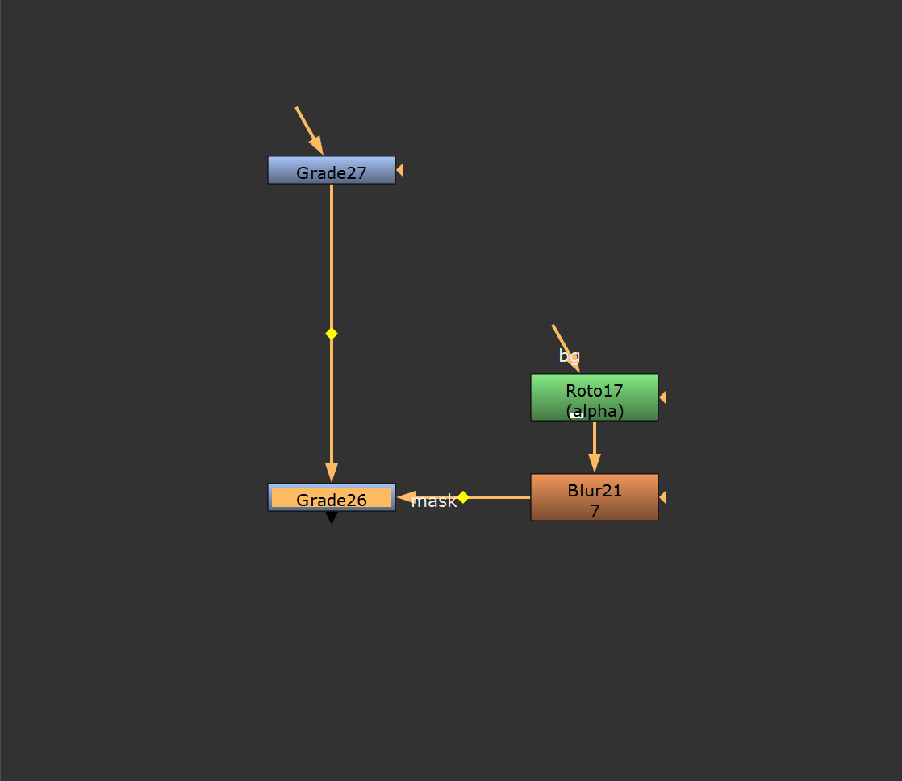
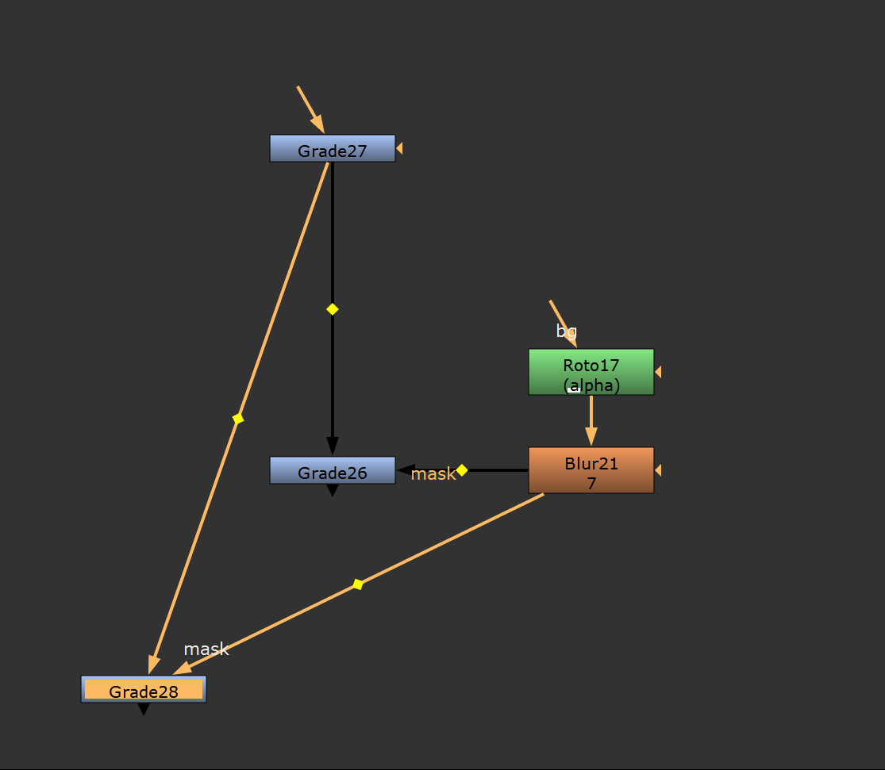
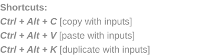

<p>
  
  <span style="font-size:1.6em;font-weight:700;line-height:1;">LGA TOOL PACK B</span><br>
  <span style="font-style:italic;line-height:1;">Lega | v1.08</span><br>
</p>
<br clear="left">

## Instalación

- Copiar la carpeta **LGA_ToolPack-B** que contiene todos los archivos del ToolPack-B a **%USERPROFILE%/.nuke**.<br> Debería quedar así:
   ```
   .nuke/
   └─ LGA_ToolPack-B/
      ├─ menu.py
      ├─ py/
      └─ ...
  ```

- Con un editor de texto, agregar esta línea de código al archivo**init.py** que está dentro de la carpeta **.nuke**:

  ```
  nuke.pluginAddPath('./LGA_ToolPack-B')
  ```

- El pack permite **activar/desactivar** herramientas desde el menú **TP2 > Enable Tools**, que se explica acá abajo.

<br>


## Enable Tools v1.05 | Lega

Para elegir qué herramientas del pack aparecen en el menú.<br>
Se abre desde **TP2 > Enable Tools** y muestra una casilla por herramienta, agrupadas igual que el menú. La que se destilda se oculta del menú y además **no se carga**, así que apagar lo que no se usa también le saca trabajo al arranque de Nuke. Los cambios se aplican al reiniciar Nuke.<br>
La elección se guarda **fuera del pack**, en **%APPDATA%\LGA\ToolPack_B\Enabled.ini** (Windows) o **~/Library/Application Support/LGA/ToolPack_B/Enabled.ini** (macOS), así que actualizar el pack no la pisa. El path del archivo se muestra abajo de todo y se puede clickear para abrirlo en el explorador de archivos.<br>
**All On** y **All Off** tildan y destildan todo; **Reset** vuelve a los valores de fábrica, que igual hay que guardar con **Save**.



<br>


<br><br>


##  Media Missing Frames v1.1 | Lega

Escanea todos los nodos Read del script y detecta secuencias EXR con frames faltantes.<br>
Muestra una tabla con la ruta del archivo, el nombre del Read, el rango detectado y los frames ausentes para localizar rápidamente problemas de media antes de renderizar o publicar.
<br><br>


<br>


##  Reload all Reads v1.0 | Lega

Ejecuta el comando **reload** sobre todos los nodos Read del script actual.<br>
Útil cuando se actualizó media en disco y se quiere refrescar todo el proyecto de una sola vez.
<br><br>


<br>


##  Rename Writes from Reads v1.0 | Lega

Renombra los nodos Write seleccionados usando el nombre del archivo del Read conectado aguas arriba.<br>
Elimina el padding final después del último guion bajo para dejar un nombre más limpio y consistente en los Writes.
<br><br>


<br>


##  CopyCat Cleaner v1.02 | Lega

Analiza todos los nodos Inference del script, compara el modelo .cat usado con el más reciente disponible en su carpeta y permite limpiar versiones antiguas junto con sus imágenes de entrenamiento.<br>
Muestra los resultados en una tabla con estado (Match / Outdated / Missing) y un botón Clean para mover los archivos no usados a una carpeta “clean” paralela.<br><br>


<br>


##  Update Folder Favs v1.01 | Lega

Detecta si Nuke/Hiero está corriendo en **Windows** o **macOS**, verifica la ubicación de **Desktop** y del volumen **T:** correspondiente, escanea todas las carpetas que empiezan con **VFX-** y muestra un diálogo con el detalle de los cambios que se van a aplicar en los favoritos del file browser.<br>
Antes de escribir, crea siempre un backup **.back** del archivo **FileChooser_Favorites.pref** y actualiza únicamente los favoritos administrados por la herramienta, manteniendo intactos los demás.

<br>


<br><br>


##  Read -> FrameRange v1.0 | Lega

Copia el rango de frames de un nodo Read seleccionado a uno o más nodos FrameRange seleccionados.<br>
La herramienta requiere seleccionar exactamente un Read y al menos un FrameRange.
<br><br>


<br>


##  Read -> Write v1.0 | Lega

Activa **use limit** en todos los nodos Write del script y ajusta su rango para que coincida con el frame range detectado en su contexto actual.<br>
Sirve para dejar los Writes limitados al rango correcto sin editar cada nodo manualmente.

<br>


##  TimeClip -> Write v1.0 | Lega

Copia el rango de frames de un nodo TimeClip al nodo Write seleccionado.<br>
La herramienta requiere seleccionar exactamente un Write y un TimeClip.
<br><br>


<br>


<br><br>


##  Paste to selected v1.1 | Frank Rueter

[http://www.nukepedia.com/python/nodegraph/pastetoselected](http://www.nukepedia.com/python/nodegraph/pastetoselected)<br>
Pega los nodos del portapapeles a todos los nodos seleccionados.<br>


<br><br>


<br>


##  Duplicate with inputs v1.3 | Marcel Pichert

[http://www.nukepedia.com/python/nodegraph/duplicate-with-inputs](http://www.nukepedia.com/python/nodegraph/duplicate-with-inputs)<br>
Duplica los nodos seleccionados y mantiene todas sus conexiones con nodos que no están en la selección. Se pueden duplicar los nodos directamente o copiarlos primero y pegarlos en otro lugar del script más tarde.<br>


<br><br>


<br>


<br><br>


Esta sección agrupa herramientas para construir setups, editar knobs o acelerar tareas repetitivas dentro del script.

<br>


##  Apply AMF v0.12 | Lega

Construye la cadena de color que declara el archivo **.amf** del shot, que vive junto al plate en `_input/Look_Files`.<br>
Crea unicamente los transforms que el .amf marca como no aplicados y los inserta debajo del nodo seleccionado. Cada nodo queda con el working space en el que corre esa parte de la cadena: ACES2065-1 por defecto, o el que declare el .amf -ACEScct para el CDL-. Si el shot trae varios plates pregunta cual aplicar, y opcionalmente deja una copia suelta asignada como Input Process del Viewer.

<br>


##  DasGrain Kronos Comp v1.1 | Lega

Sincroniza la intensidad del grano de un nodo **DasGrain** con la interpolación de un nodo **Kronos**.<br>
Agrega un tab **KroComp** al DasGrain seleccionado, crea knobs de control y modifica la expresión del knob **luminance** para compensar el grano en frames interpolados.

<br>


##  Animation Maker v1.5 | David Emeny 2025

Agrega un editor visual para construir expresiones de animación con eases, loops y waves sobre knobs animables.<br>
Se accede desde el menú contextual de cualquier knob animable con **Right click > Animation Maker**.

<br>


##  Multi Knob Edit | Thorsten Loeffler

Permite editar un mismo knob sobre múltiples nodos al mismo tiempo desde una sola interfaz.<br>
Es útil para cambios masivos rápidos cuando hay que igualar parámetros entre varios nodos seleccionados.
<br><br>


<br>


##  Edit Default Knobs Values v5.0.0 | Simon Jokuschies

Abre una ventana para definir, listar y resetear valores por defecto de knobs en Nuke.<br>
Incluye integración con el menú **Animation** para crear nuevos `knobDefault`, revisar la lista activa y restaurar valores.

<br>


<br><br>


##  OCIOFileTransform Setup v1.0 | Lega

Duplica un nodo **OCIOFileTransform** seleccionado, conserva su configuración y prepara una copia rotulada como **MOV Render**.<br>
Además asigna el nodo original como **Input Process** en los viewers disponibles para acelerar el setup de visualización y render.
<br><br>


<br>


##  CDL -> CC Input Process v1.0 | Lega

Lee un archivo CDL desde un nodo **Read** u **OCIOCDLTransform**, genera un archivo **.cc** y crea nodos **OCIOFileTransform** para usarlo tanto en render como en el Input Process del viewer.<br>
Sirve para convertir grades CDL en un setup práctico de visualización y salida dentro del script.

<br>


##  Performance Timers | Sebastian Schütt

Abre un panel con controles para iniciar, detener y resetear los performance timers de Nuke.<br>
También registra el panel dentro del menú **Pane** para dejarlo disponible como panel acoplable.

<br>


##  Edit Keyboard Shortcuts v1.2 | dbr

Abre una interfaz para revisar y editar shortcuts del menú de Nuke.<br>
La herramienta se integra al arranque del ToolPack-B y permite redefinir teclas sin editar manualmente `menu.py`.

<br>
