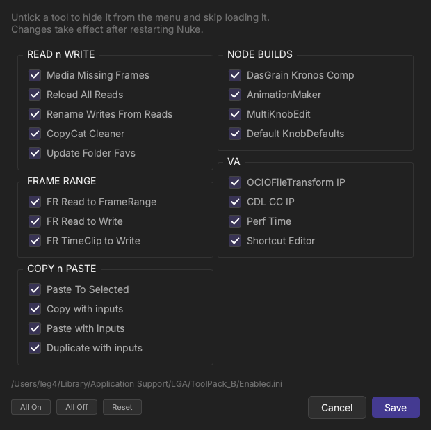
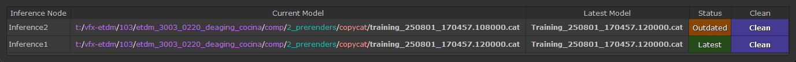
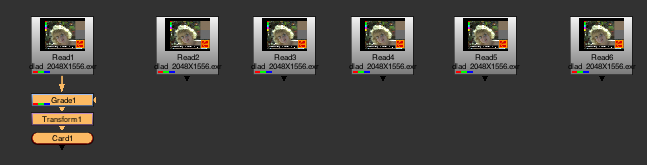
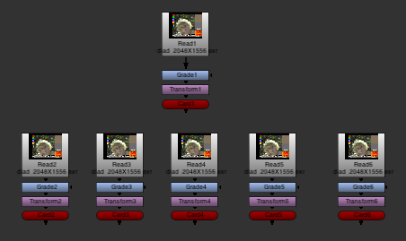
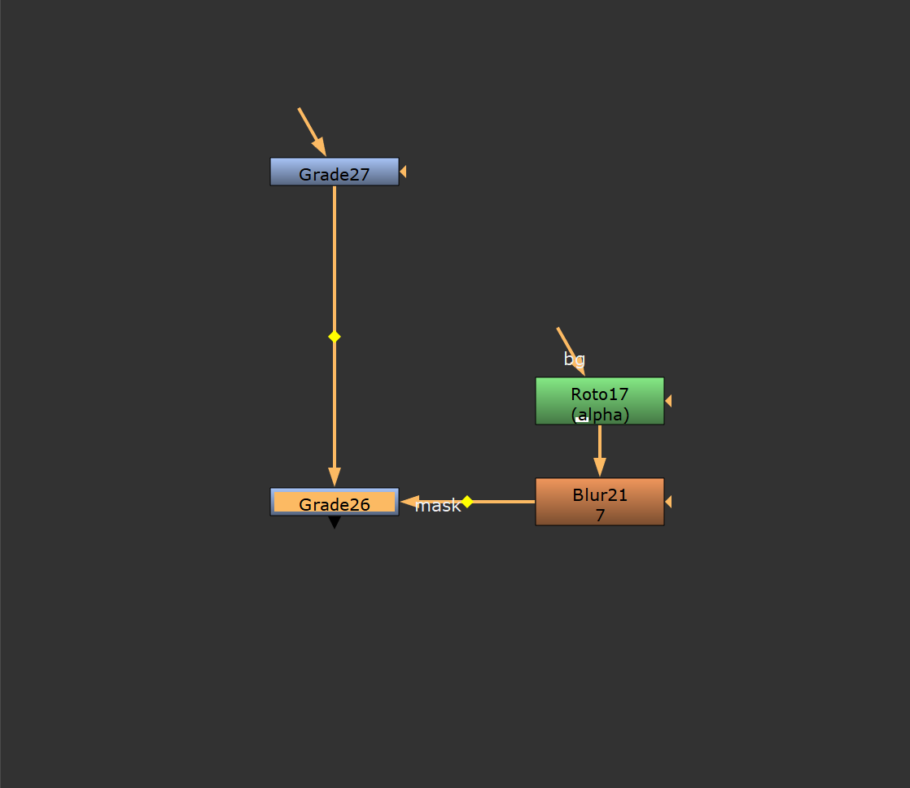
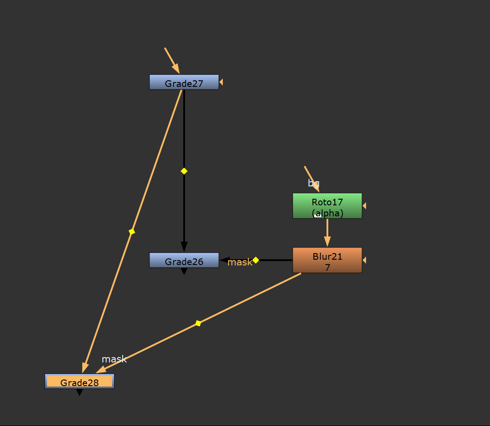
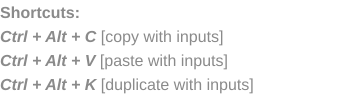

<p align="right"><b>English</b> · <a href="README_ES.md">Español</a></p>

<p>
  
  <span style="font-size:1.6em;font-weight:700;line-height:1;">LGA TOOL PACK B</span><br>
  <span style="font-style:italic;line-height:1;">Lega | v1.09</span><br>
</p>
<br clear="left">

**What's new:** [Releases](https://github.com/legandrop/LGA_ToolPack_B-for_Nuke/releases)

## Installation

- Copy the **LGA_ToolPack-B** folder, which contains all the ToolPack-B files, to **%USERPROFILE%/.nuke**.<br> It should look like this:
   ```
   .nuke/
   └─ LGA_ToolPack-B/
      ├─ menu.py
      ├─ py/
      └─ ...
  ```

- Using a text editor, add this line of code to the **init.py** file inside the **.nuke** folder:

  ```
  nuke.pluginAddPath('./LGA_ToolPack-B')
  ```

- The pack lets you **turn tools on and off** from the **TP2 > Enable Tools** menu, explained below.

<br>


## Enable Tools v1.05 | Lega

Choose which tools from the pack show up in the menu.<br>
Open it from **TP2 > Enable Tools**. It shows a checkbox for each tool, grouped the same way as the menu. An unchecked tool is hidden from the menu and also **is not loaded**, so turning off what you don't use also lightens Nuke's startup. Changes take effect after restarting Nuke.<br>
Your choice is saved **outside the pack**, in **%APPDATA%\LGA\ToolPack_B\Enabled.ini** (Windows) or **~/Library/Application Support/LGA/ToolPack_B/Enabled.ini** (macOS), so updating the pack doesn't overwrite it. The file path is shown at the very bottom, and you can click it to open it in the file browser.<br>
**All On** and **All Off** check and uncheck everything; **Reset** restores the factory defaults, which you still need to save with **Save**.



<br>


<br><br>


##  Media Missing Frames v1.1 | Lega

Scans all Read nodes in the script and finds EXR sequences with missing frames.<br>
Shows a table with the file path, the Read name, the detected range and the missing frames, so you can quickly spot media problems before rendering or publishing.
<br><br>


<br>


##  Reload all Reads v1.0 | Lega

Runs the **reload** command on all Read nodes in the current script.<br>
Useful when media was updated on disk and you want to refresh the whole project at once.
<br><br>


<br>


##  Rename Writes from Reads v1.0 | Lega

Renames the selected Write nodes using the file name of the Read connected upstream.<br>
Removes the trailing padding after the last underscore, for a cleaner and more consistent Write name.
<br><br>


<br>


##  CopyCat Cleaner v1.02 | Lega

Analyzes all Inference nodes in the script, compares the .cat model in use with the latest one available in its folder, and lets you clean up old versions along with their training images.<br>
Shows the results in a table with a status (Match / Outdated / Missing) and a Clean button that moves unused files to a parallel “clean” folder.<br><br>


<br>


##  Update Folder Favs v1.01 | Lega

Detects whether Nuke/Hiero is running on **Windows** or **macOS**, checks the location of the **Desktop** and of the matching **T:** volume, scans all folders that start with **VFX-** and shows a dialog detailing the changes that will be applied to the file browser favorites.<br>
Before writing, it always creates a **.back** backup of the **FileChooser_Favorites.pref** file, and only updates the favorites managed by the tool, leaving all others untouched.

<br>


<br><br>


##  Read -> FrameRange v1.0 | Lega

Copies the frame range of a selected Read node to one or more selected FrameRange nodes.<br>
The tool requires exactly one selected Read and at least one FrameRange.
<br><br>


<br>


##  Read -> Write v1.0 | Lega

Enables **use limit** on all Write nodes in the script and sets their range to match the frame range detected in their current context.<br>
Keeps the Writes limited to the correct range without editing each node by hand.

<br>


##  TimeClip -> Write v1.02 | Lega

Copies the output frame range of a TimeClip node to the selected Write node, including start at and offset.<br>
The tool requires exactly one selected Write and one TimeClip.
<br><br>


<br>


<br><br>


##  Paste to selected v1.1 | Frank Rueter

[http://www.nukepedia.com/python/nodegraph/pastetoselected](http://www.nukepedia.com/python/nodegraph/pastetoselected)<br>
Pastes the clipboard nodes onto all selected nodes.<br>


<br><br>


<br>


##  Duplicate with inputs v1.3 | Marcel Pichert

[http://www.nukepedia.com/python/nodegraph/duplicate-with-inputs](http://www.nukepedia.com/python/nodegraph/duplicate-with-inputs)<br>
Duplicates the selected nodes and keeps all their connections to nodes outside the selection. You can duplicate the nodes directly, or copy them first and paste them somewhere else in the script later.<br>


<br><br>


<br>


<br><br>


This section groups tools to build setups, edit knobs or speed up repetitive tasks in the script.

<br>


##  AMF v0.14 | Lega

Builds the color chain declared by the shot's **.amf** file, which lives next to the plate in `_input/Look_Files`.<br>
Creates only the transforms the .amf marks as not applied, and inserts them below the selected node. Each node gets the working space that part of the chain runs in: ACES2065-1 by default, or whatever the .amf declares -ACEScct for the CDL-. If the shot has several plates, it asks which one to apply, and it can optionally leave a separate copy assigned as the Viewer's Input Process.

<br>


##  DasGrain Kronos Comp v1.1 | Lega

Syncs the grain intensity of a **DasGrain** node with the interpolation of a **Kronos** node.<br>
Adds a **KroComp** tab to the selected DasGrain, creates control knobs and modifies the expression of the **luminance** knob to compensate the grain on interpolated frames.

<br>


##  Animation Maker v1.5 | David Emeny 2025

Adds a visual editor to build animation expressions with eases, loops and waves on animatable knobs.<br>
Access it from the context menu of any animatable knob with **Right click > Animation Maker**.

<br>


##  Multi Knob Edit | Thorsten Loeffler

Lets you edit the same knob on multiple nodes at once from a single interface.<br>
Useful for quick bulk changes when you need to match parameters across several selected nodes.
<br><br>


<br>


##  Edit Default Knobs Values v5.0.0 | Simon Jokuschies

Opens a window to set, list and reset knob default values in Nuke.<br>
Integrates with the **Animation** menu to create new `knobDefault`, review the active list and restore values.

<br>


<br><br>


##  OCIOFileTransform Setup v1.0 | Lega

Duplicates a selected **OCIOFileTransform** node, keeps its settings and prepares a copy labeled **MOV Render**.<br>
It also assigns the original node as the **Input Process** of the available viewers, to speed up the viewing and render setup.
<br><br>


<br>


##  CDL -> CC Input Process v1.02 | Lega

Reads a CDL file from a **Read** or **OCIOCDLTransform** node, generates a **.cc** file and creates **OCIOFileTransform** nodes to use it both for rendering and in the viewer's Input Process.<br>
Turns CDL grades into a practical viewing and output setup inside the script.

<br>


##  Performance Timers | Sebastian Schütt

Opens a panel with controls to start, stop and reset Nuke's performance timers.<br>
It also registers the panel in the **Pane** menu so it is available as a dockable panel.

<br>


##  Edit Keyboard Shortcuts v1.2 | dbr

Opens an interface to review and edit Nuke menu shortcuts.<br>
The tool hooks into ToolPack-B at startup and lets you remap keys without manually editing `menu.py`.

<br>
